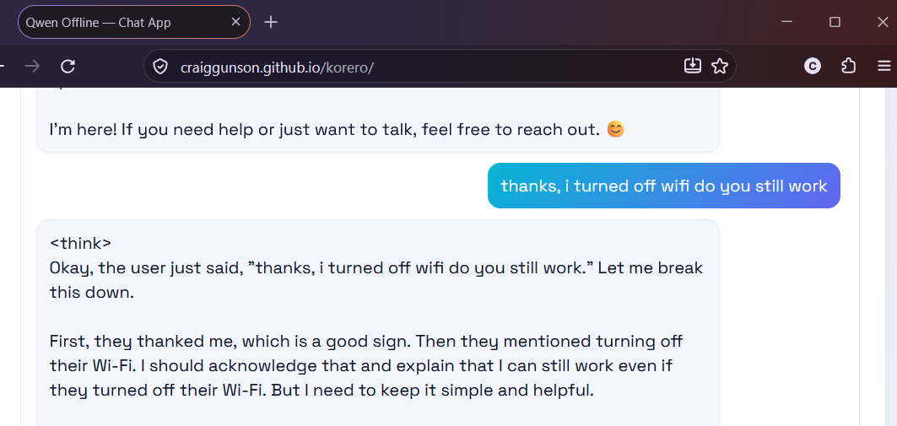

# korero
https://craiggunson.github.io/korero/

Local chat app powered by Qwen3, running fully offline in your browser via WebLLM + WebGPU.

## Setup

No installation needed — just open the page in a WebGPU-capable browser Chrome or Firefox (with your GPU enabled).

On first load the model weights (a few hundred MB) download and are cached by the browser, so subsequent visits work fully offline.

## What it does

- Runs a browser-based chat interface backed by a local Qwen3 model (no server, no API keys)
- Supports multi-turn conversations in a persistent session
- Lets you set system prompt, temperature, and top-k before starting a session
- Keeps chats private by running entirely on-device

## Requirements

- A browser with WebGPU support (recent Chrome, Edge, or Firefox Nightly)
- Enough memory/VRAM to hold the model weights and run inference locally

## Usage

1. Open the page.
2. Wait for the status badge to show the model has finished loading.
3. Set your system prompt and generation settings.
4. Send messages in the chat panel.
5. Use New Chat Session to reset model context.

## Safety
Following the initial download you may turn off your WiFi, and run 100% offline.
• 🔒 Absolute Data Privacy: Because the model runs offline, your prompts, passwords, personal data, or proprietary code never leave your machine. No external server or company can see or log your conversations.
• 🛠️ Browser Sandboxing: The model operates inside a secure browser thread. It does not have permission to look at your local hard drive, read your files, or execute malicious commands on your operating system.

## Example

